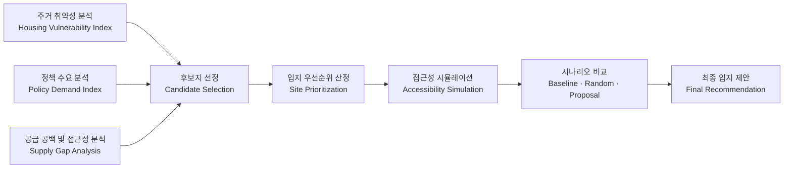

# 🏘️ 서울시 주거취약지역 기반 모아센터 입지 우선순위 분석

### Data-Driven Site Prioritization for Additional Moa Centers in Seoul

> 주거 취약성, 정책 수요, 공급 공백을 바탕으로 서울시 모아센터 추가 입지 우선순위를 분석한 공간 데이터 기반 정책 분석 프로젝트

---

## Overview

본 프로젝트는 서울시 행정동 단위의 주거 취약성(HVI), 정책 수요, 기존 모아센터 접근성을 종합적으로 분석하여 모아센터 추가 설치 우선순위를 도출한 공간 데이터 기반 정책 분석 프로젝트입니다.

단순히 취약한 지역을 찾는 데서 끝나지 않고,

- 주거 취약성
- 정책 수요
- 기존 공급 공백
- 접근성 개선 효과

를 함께 고려하여,

> "어디에 모아센터를 우선적으로 추가 배치하는 것이 타당한가?"

를 데이터 기반으로 분석하는 것을 목표로 했습니다.

---

## Key Features

- 행정동 단위 Housing Vulnerability Index(HVI) 구축
- 정책 수요 지표 기반 우선순위 산정
- 기존 모아센터 접근성 및 공급 공백 분석
- 공급 공백 지역 후보지 선정
- 추가 설치 시 접근성 변화 시뮬레이션
- 무작위 배치(Random Allocation) 시나리오와 비교
- 지도 기반 결과 시각화

---
## Tech Stack

### Language

<p>
  
</p>

### Data Processing & Analysis

<p>
  
  
  
  
</p>

### Spatial Analysis & Simulation

<p>
  
  
  
  
</p>

### Visualization

<p>
  
  
  
</p>

---

## Analysis Framework

### 1️⃣ Housing Vulnerability Index (HVI)

행정동별 주거 취약성을 나타내기 위해 다음 지표를 구성했습니다.

* 저가 주거 비율
* 노후 주택 비율
* 연립·다세대 집적도
* 건축물대장 기반 데이터 품질 보완

주거 취약성은 저가 주거, 노후도, 밀집도를 중심으로 정의했으며, 세 지표가 모두 높은 지역을 상대적으로 주거 취약성이 높은 지역으로 해석했습니다.

### 2️⃣ Policy Demand Index

행정동별 정책 수요를 비교하기 위해 다음 지표를 사용했습니다.

* 고령층 관련 지표
* 장애인 및 저소득층 관련 지표
* 생활 인프라 지표
* 재난·안전 지표
* 범죄 취약성 지표
* 통신·생활 데이터 기반 보조 지표

### 3️⃣ Accessibility & Supply Gap

기존 모아센터 분포와 접근성을 기준으로 공급 공백 지역을 분석했습니다.

* 기존 모아센터 위치 행정동 제외
* 행정동 대표점 기준 거리 계산
* 접근성이 낮은 행정동 확인
* 공급 공백 지역 탐색
* 추가 설치 시 접근성 변화 시뮬레이션

---

## Analysis Workflow


    
---

## Simulation Scenarios

| Scenario | Description                                       |
| -------- | ------------------------------------------------- |
| S0       | Existing 14 Centers (Baseline)                    |
| S1       | Random 14 Allocation (1,000 Iterations)           |
| S2       | Top 14 by Demand Index                            |
| S3       | Top 14 by Final Index                             |
| S4       | Final Proposal with HVI Filter & Spillover Effect |

---

## Main Findings

* 기존 모아센터 분포에서 상대적으로 소외된 지역 확인
* 공급 공백과 정책 수요를 기준으로 후보지 선정
* 무작위 배치 대비 더 높은 접근성 개선 효과 확인
* 주거 취약성과 정책 수요를 함께 고려한 입지 우선순위 제시
* 추가 설치 시 접근성 개선 규모 비교

---

## Project Structure

```bash
.
├── README.md
├── requirements.txt

├── data/                               # 원천 데이터 및 데이터 구조 설명
│   └── README.md

├── docs/
│   ├── presentation/                   # 발표 자료
│   ├── report/                         # 분석 결과 보고서
│   └── references/                     # 참고 문헌 및 관련 자료

├── notebooks/
│   ├── 01_hvi_construction/            # 주거취약성지수(HVI) 산출
│   ├── 02_policy_demand/               # 정책 수요 지표 구축
│   ├── 03_supply_accessibility/        # 공급 공백 및 접근성 분석
│   ├── 04_index_integration/           # 지표 통합 및 우선순위 산정
│   └── 05_validation_visualization/    # 결과 검증 및 시각화

├── src/
│   ├── 01_candidate_selection/         # 후보지 선정 로직
│   ├── 02_accessibility_simulation/    # 접근성 시뮬레이션
│   └── 03_visualization/               # 지도 및 결과 시각화

├── assets/
│   ├── figures/                        # 분석 결과 이미지
│   └── maps/                           # 인터랙티브 지도 및 공간 분석 결과

└── archive/
    └── hvi_experiments/                # HVI 산출 실험 및 보관 코드
```


---

## Data Sources

* 서울시 빅데이터캠퍼스
* 공공데이터포털
* 서울시 건축물대장 데이터
* 서울시 행정동 경계 데이터
* 기존 모아센터 위치 정보

⚠️ 일부 원본 데이터는 반출 정책상 공개가 제한될 수 있습니다.

---

## Limitations

- 행정동 대표점 기반 거리 계산 사용
- 실제 보행 접근성과 차이 가능성 존재
- 일부 데이터는 가공 지표 형태 활용
- 실제 설치 가능성은 추가 행정 검토 필요

---

## Conclusion

본 프로젝트는 주거 취약성, 정책 수요, 공급 공백을 함께 고려하여 서울시 내 모아센터 추가 설치 우선순위를 도출하고,  
시뮬레이션을 통해 실제 접근성 개선 효과를 검증하는 데 초점을 두었습니다.
단일 지표 기반 접근이 아닌 공간적 공급 불균형과 정책 수요를 함께 반영했다는 점에서 공공정책 기반 공간 데이터 분석 사례로 의미가 있습니다.
